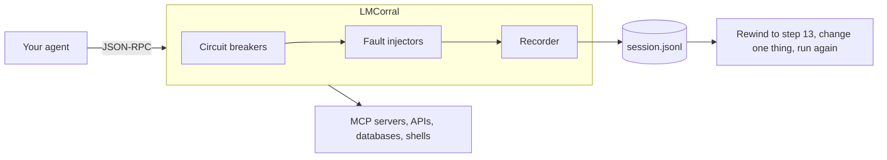

# LMCorral

**Corral your language models.** Break your agents outside production, and stop them when they
bolt.

[](https://github.com/gilbo123/LMCorral/actions/workflows/ci.yml)
[](LICENSE)
[](pyproject.toml)

> **Status: pre-alpha.** The scaffolding is in place and the design is written down. The proxy
> itself is being built now, in the open. See [ROADMAP.md](ROADMAP.md).

## The problem

An agent that can only produce text fails by saying something wrong. An agent with tools fails
by *doing* something wrong.

It retries a failing tool four hundred times overnight and spends nine hundred dollars. It
reads a corrupted file, passes the garbage downstream, and another agent runs a `DELETE` based
on it. A connection drops mid-stream and instead of degrading gracefully it invents the
missing parameters and sends them.

You cannot find these failure modes by hoping. You have to cause them.

## What LMCorral does

It is a sidecar on the wire between your agent and the tools it can reach, and it does two
jobs at once.

**It breaks things on purpose.** Delay a database call by eight seconds. Return a payload that
satisfies the declared schema but has a boolean flipped. Throw a burst of 429s halfway through
a task. Then watch what your agent does about it.

**It stops things going wrong.** Hard limits the agent cannot reason its way around: sever
network access if spend crosses two dollars in thirty seconds, halt on the third
near-identical `bash_run`, refuse any tool call matching a deny rule, freeze the process and
dump full state for inspection.

The second half is the part that does not exist elsewhere, and it is why LMCorral is worth
leaving installed after the test finishes.



## Quick start

```bash
uv tool install lmcorral
```

Point it at any MCP server you already run. No config file, no code changes:

```bash
lmcorral run -- uvx my-mcp-server
```

That records everything to `session.jsonl` and changes nothing else. When you want to start
breaking things, reach for a built-in scenario:

```bash
lmcorral run --scenario flaky-network -- uvx my-mcp-server
```

And when you need something specific, `lmcorral.yaml`:

```yaml
seed: 1337

faults:
  - name: slow-database
    target: { tool: query_db }
    inject: { latency: { ms: 8000 } }

  - name: subtle-corruption
    target: { tool: get_account }
    # Passes the declared outputSchema, but is wrong. The hardest fault to catch,
    # because nothing in your telemetry looks unusual.
    inject: { corrupt: { mode: schema_valid, rate: 0.2 } }

  - name: rate-limit-storm
    target: { tool: "*" }
    inject: { error: { http: 429, burst: 3, retry_after: 2 } }

breakers:
  - cost_velocity: { usd: 2.00, window_s: 30, action: freeze }
  - tool_loop: { calls: 3, similarity: 0.8, action: prompt }
  - blast_radius: { deny: ["drop_table", "send_email"], action: block }
```

## Why another one of these

There are several chaos-testing tools for AI agents. We surveyed all of them before starting;
the write-up is in [docs/prior-art.md](docs/prior-art.md), including what each does well and
what we intend to borrow.

The short version: they all inject faults, and every one of them is a test harness you run
deliberately and then uninstall. None of them enforce anything. None of them let you rewind a
recorded session to step 13, change one tool response, and run forward deterministically.
And the most popular of them has eleven stars, which suggests the missing ingredient is not
features but the cost of trying the thing at all.

So ease of use is treated here as a release blocker with a stopwatch attached, not an
aspiration. Every milestone in the roadmap carries a time-to-first-result budget, and the
budget never grows.

## Documentation

- [ROADMAP.md](ROADMAP.md) — what is built, what is next, what is out of scope
- [docs/architecture.md](docs/architecture.md) — how it works and why it is built this way
- [docs/prior-art.md](docs/prior-art.md) — the other projects in this space
- [CONTRIBUTING.md](CONTRIBUTING.md) — how to help
- [SECURITY.md](SECURITY.md) — including an honest account of what LMCorral cannot protect you from

## Licence

Apache 2.0. See [LICENSE](LICENSE).
